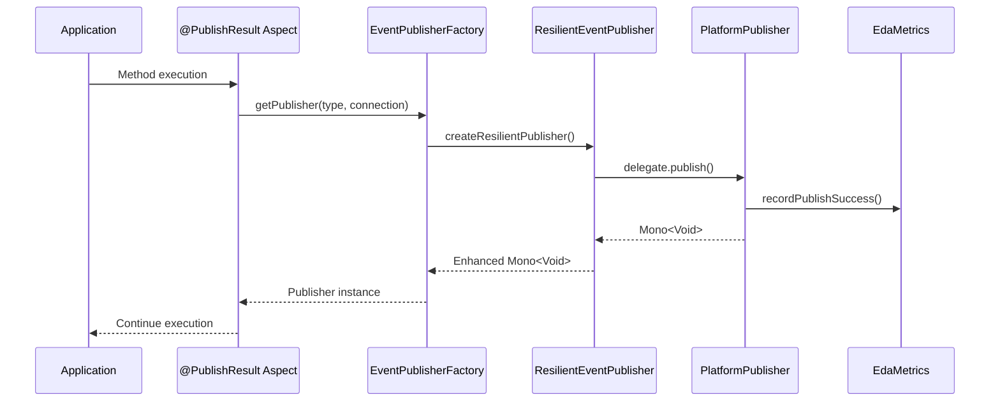
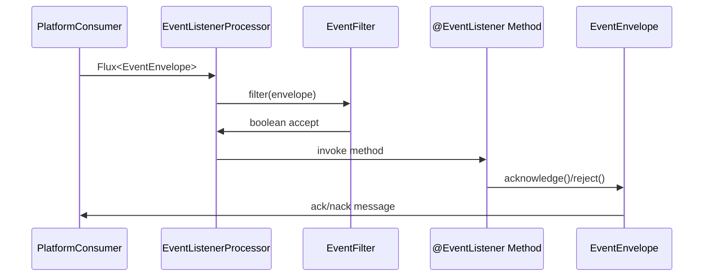

# Firefly EDA Library Architecture

This document provides a comprehensive overview of the Firefly Event-Driven Architecture (EDA) library's architecture, design principles, and implementation patterns.

## Table of Contents

- [Overview](#overview)
- [Architecture Principles](#architecture-principles)
- [Core Components](#core-components)
- [Component Interactions](#component-interactions)
- [Publisher Architecture](#publisher-architecture)
- [Consumer Architecture](#consumer-architecture)
- [Serialization Layer](#serialization-layer)
- [Resilience Patterns](#resilience-patterns)
- [Configuration Architecture](#configuration-architecture)
- [Metrics and Health](#metrics-and-health)
- [Extension Points](#extension-points)
- [Design Patterns Used](#design-patterns-used)

## Overview

The Firefly EDA Library implements a **Layered Architecture** with clear separation of concerns, following **SOLID principles** and **Reactive Programming** paradigms. It provides a unified abstraction layer over multiple messaging platforms while maintaining platform-specific optimizations.

```
┌─────────────────────────────────────────────────────────────┐
│                    Application Layer                        │
│  (@PublishResult, @EventListener, Business Logic)           │
└─────────────────────────────────────────────────────────────┘
                                │
                                ▼
┌─────────────────────────────────────────────────────────────┐
│                 EDA Abstraction Layer                       │
│  (EventPublisher, EventConsumer, EventEnvelope)             │
├─────────────────────────────────────────────────────────────┤
│     Event Processing    │    Publisher Factory   │ Filters  │
│     & Listeners         │    & Management        │ & Routing│
└─────────────────────────────────────────────────────────────┘
                                │
                                ▼
┌─────────────────────────────────────────────────────────────┐
│                   Infrastructure Layer                      │
│            (Resilience, Serialization, Health)              │
├─────────────────────────────────────────────────────────────┤
│  Circuit Breaker  │ Message      │ Health Checks│  Metrics  │
│  Retry & RateLimit│ Serialization│ & Monitoring │ Collection│
└─────────────────────────────────────────────────────────────┘
                                │
                                ▼
┌─────────────────────────────────────────────────────────────┐
│                 Platform Adapter Layer                      │
├───────────┬───────────┬─────────────┬─────────────────────────┤
│   Kafka   │ RabbitMQ  │Spring Events│         NOOP            │
│Publishers │Publishers │Publishers   │       Publishers        │
│Consumers  │Consumers  │Consumers    │                         │
└───────────┴───────────┴─────────────┴─────────────────────────┘
```

## Architecture Principles

### 1. **Reactive-First Design**
- All operations return `Mono<T>` or `Flux<T>`
- Non-blocking I/O throughout the stack
- Backpressure support for high-throughput scenarios
- Scheduler-aware for proper thread management

### 2. **Platform Agnostic**
- Unified interfaces hide platform-specific details
- Auto-discovery and configuration
- Pluggable architecture for new platforms

### 3. **Production Ready**
- Built-in resilience patterns
- Comprehensive observability
- Health monitoring and metrics
- Graceful degradation

### 4. **Spring Boot Integration**
- Auto-configuration with sensible defaults
- Property-driven configuration
- Seamless integration with Spring ecosystem

## Core Components

### EventPublisher Interface

The heart of the publishing abstraction:

```java
public interface EventPublisher {
    Mono<Void> publish(Object event, String destination, Map<String, Object> headers);
    boolean isAvailable();
    PublisherType getPublisherType();
    Mono<PublisherHealth> getHealth();
}
```

**Design Decisions:**
- **Reactive Return Type**: `Mono<Void>` enables non-blocking publishing
- **Generic Event Type**: `Object` allows any serializable event
- **Flexible Headers**: `Map<String, Object>` supports platform-specific metadata
- **Health Awareness**: Built-in health checking for circuit breaker integration

### EventConsumer Interface

Reactive event consumption abstraction:

```java
public interface EventConsumer {
    Flux<EventEnvelope> consume();
    Flux<EventEnvelope> consume(String... destinations);
    Mono<Void> start();
    Mono<Void> stop();
    boolean isRunning();
}
```

**Key Features:**
- **Backpressure Support**: `Flux<EventEnvelope>` handles high-throughput scenarios
- **Lifecycle Management**: Start/stop semantics for controlled consumption
- **Multi-Destination**: Support for consuming from multiple sources

### EventEnvelope Record

Immutable event container with rich metadata:

```java
public record EventEnvelope(
    String destination,
    String eventType,
    Object payload,
    String transactionId,
    Map<String, Object> headers,
    Instant timestamp,
    String consumerType,
    AckCallback ackCallback
) {
    public Mono<Void> acknowledge() { ... }
    public Mono<Void> reject(Throwable error) { ... }
}
```

**Design Benefits:**
- **Immutable**: Thread-safe and predictable
- **Rich Metadata**: Full context for event processing
- **Acknowledgment Support**: Platform-agnostic ack/nack semantics

## Component Interactions

### Publishing Flow



### Consumption Flow



## Publisher Architecture

### Publisher Factory Pattern

The `EventPublisherFactory` implements a **Factory Pattern** with caching:

```java
@Component
public class EventPublisherFactory {
    private final Map<String, EventPublisher> publisherCache = new ConcurrentHashMap<>();
    
    public EventPublisher getPublisher(PublisherType type, String connectionId) {
        String cacheKey = getCacheKey(type, connectionId);
        return publisherCache.computeIfAbsent(cacheKey, 
            key -> createPublisher(type, connectionId));
    }
}
```

**Benefits:**
- **Performance**: Cached publisher instances
- **Thread Safety**: ConcurrentHashMap for concurrent access
- **Auto-Discovery**: Automatic detection of available publishers
- **Connection Management**: Multiple connections per publisher type

### Connection-Aware Publishers

Publishers implementing `ConnectionAwarePublisher` support multiple configurations:

```java
public interface ConnectionAwarePublisher extends EventPublisher {
    String getConnectionId();
    void setConnectionId(String connectionId);
    boolean isConnectionConfigured(String connectionId);
}
```

**Use Cases:**
- Multi-tenant applications
- Different environments (dev/staging/prod)
- Load balancing across clusters
- Failover scenarios

### Auto-Selection Algorithm

The `PublisherType.AUTO` implements a priority-based selection:

```java
PublisherType[] priorityOrder = {
    PublisherType.KAFKA,        // Highest throughput, partitioning, persistence
    PublisherType.RABBITMQ,     // Feature-rich routing, guaranteed delivery
    PublisherType.APPLICATION_EVENT, // In-memory fallback for simple cases
    PublisherType.NOOP          // Testing/disabled mode
};
```

## Consumer Architecture

### Event Processing Pipeline

The consumer architecture implements a **Pipeline Pattern**:

1. **Message Reception**: Platform-specific message polling
2. **Envelope Creation**: Wrapping in EventEnvelope with metadata
3. **Filtering**: EventFilter chain application
4. **Listener Matching**: @EventListener method resolution
5. **Method Invocation**: Reactive method execution
6. **Acknowledgment**: Success/failure acknowledgment

### Event Filtering System

Hierarchical filter system with composition support:

```java
// Base filter interface
public interface EventFilter {
    boolean accept(String messageBody, Map<String, Object> headers);
    boolean matches(EventEnvelope envelope);
}

// Composite filters
EventFilter complexFilter = EventFilter.and(
    EventFilter.byDestination("orders"),
    EventFilter.byEventType("*.created"),
    EventFilter.byHeader("priority", "high")
);
```

**Filter Types:**
- **DestinationEventFilter**: Topic/queue matching
- **EventTypeFilter**: Type pattern matching (with globs)
- **HeaderEventFilter**: Header-based filtering
- **CompositeEventFilter**: Logical combinations (AND/OR/NOT)

## Serialization Layer

### MessageSerializer Abstraction

Pluggable serialization with format detection:

```java
public interface MessageSerializer {
    byte[] serialize(Object payload) throws SerializationException;
    <T> T deserialize(byte[] data, Class<T> targetType) throws SerializationException;
    SerializationFormat getFormat();
    String getContentType();
    int getPriority(); // For auto-selection
}
```

**Available Implementations:**
- **JsonMessageSerializer**: Jackson-based JSON serialization
- **AvroMessageSerializer**: Schema-based binary serialization (planned)
- **ProtobufMessageSerializer**: Protocol Buffers support (planned)

### Serialization Strategy

1. **Priority-Based Selection**: Highest priority serializer wins
2. **Content-Type Negotiation**: Based on message headers
3. **Fallback Mechanism**: Default to JSON if others fail

## Resilience Patterns

### Circuit Breaker Integration

Using Resilience4j for failure handling:

```java
CircuitBreakerConfig config = CircuitBreakerConfig.custom()
    .failureRateThreshold(50)              // 50% failure rate
    .slowCallRateThreshold(50)             // 50% slow calls
    .slowCallDurationThreshold(Duration.ofSeconds(60))
    .minimumNumberOfCalls(10)              // Min calls before evaluation
    .slidingWindowSize(10)                 // Sliding window size
    .waitDurationInOpenState(Duration.ofSeconds(60))
    .permittedNumberOfCallsInHalfOpenState(3)
    .build();
```

### Retry Strategy

Exponential backoff with jitter:

```java
RetryConfig retryConfig = RetryConfig.custom()
    .maxAttempts(3)
    .waitDuration(Duration.ofMillis(500))
    .intervalFunction(IntervalFunction.ofExponentialBackoff(
        Duration.ofMillis(500), 2.0))      // Exponential backoff
    .retryExceptions(Exception.class)
    .build();
```

### Rate Limiting

Token bucket algorithm implementation:

```java
RateLimiterConfig rateLimiterConfig = RateLimiterConfig.custom()
    .limitForPeriod(100)                   // 100 requests
    .limitRefreshPeriod(Duration.ofSeconds(1))  // per second
    .timeoutDuration(Duration.ofSeconds(5))     // wait timeout
    .build();
```

## Configuration Architecture

### Hierarchical Property Structure

```yaml
firefly:
  eda:
    enabled: true
    default-publisher-type: AUTO
    default-connection-id: default
    
    publishers:
      kafka:
        default:                    # Connection ID
          bootstrap-servers: localhost:9092
          properties:
            acks: all
            retries: 3
        cluster-a:                  # Additional connection
          bootstrap-servers: cluster-a:9092
          
    consumer:
      enabled: true
      group-id: firefly-eda
      kafka:
        default:
          topics: events,notifications
          
    resilience:
      enabled: true
      circuit-breaker:
        failure-rate-threshold: 50
      retry:
        max-attempts: 3
```

### Configuration Validation

Using Bean Validation annotations:

```java
@ConfigurationProperties(prefix = "firefly.eda")
@Validated
public class EdaProperties {
    @NotNull
    private PublisherType defaultPublisherType = PublisherType.AUTO;
    
    @NotBlank
    @Size(max = 100)
    private String defaultConnectionId = "default";
    
    @Valid
    private final Publishers publishers = new Publishers();
}
```

## Metrics and Health

### Micrometer Integration

Comprehensive metrics collection:

```java
// Publishing metrics
firefly.eda.publish.count{publisher_type, destination, status}
firefly.eda.publish.duration{publisher_type, destination, event_type, status}
firefly.eda.publish.message.size{publisher_type, destination}

// Consumption metrics
firefly.eda.consume.count{consumer_type, source, status}
firefly.eda.consume.duration{consumer_type, source, event_type, status}

// Health metrics
firefly.eda.publisher.health{publisher_type, connection_id}
firefly.eda.consumer.health{consumer_type}

// Resilience metrics
firefly.eda.circuit.breaker.state.change{publisher_type, state}
firefly.eda.retry.attempt{publisher_type, attempt, status}
firefly.eda.rate.limiter.rejection{publisher_type}
```

### Health Check Architecture

Spring Boot Actuator integration:

```java
@Component
public class EdaHealthIndicator implements HealthIndicator {
    @Override
    public Health health() {
        Health.Builder builder = new Health.Builder();
        
        // Check all publishers
        Map<String, PublisherHealth> publisherHealth = 
            publisherFactory.getPublishersHealth();
        
        boolean allHealthy = publisherHealth.values().stream()
            .allMatch(health -> health.isAvailable());
            
        return allHealthy ? 
            builder.up().withDetails(publisherHealth).build() :
            builder.down().withDetails(publisherHealth).build();
    }
}
```

## Extension Points

### Custom Publishers

Implement `EventPublisher` interface:

```java
@Component
public class CustomEventPublisher implements EventPublisher {
    @Override
    public Mono<Void> publish(Object event, String destination, Map<String, Object> headers) {
        // Custom implementation
    }
    
    @Override
    public PublisherType getPublisherType() {
        return PublisherType.NOOP; // Use existing enum value for custom implementations
    }
}
```

### Custom Error Handling

Implement custom error strategies:

```java
@Component
public class CustomErrorHandler implements EventErrorHandler {
    public Mono<Void> handleError(EventEnvelope envelope, Throwable error, 
                                 ErrorHandlingStrategy strategy) {
        // Custom error handling logic
    }
}
```

### Custom Serializers

Implement `MessageSerializer`:

```java
@Component
public class CustomMessageSerializer implements MessageSerializer {
    @Override
    public SerializationFormat getFormat() {
        return SerializationFormat.CUSTOM;
    }
    
    @Override
    public int getPriority() {
        return 100; // Higher than default
    }
}
```

## Design Patterns Used

### Creational Patterns
- **Factory Pattern**: EventPublisherFactory for publisher creation
- **Builder Pattern**: Configuration objects and health status
- **Singleton Pattern**: Cached publisher instances

### Structural Patterns
- **Adapter Pattern**: Platform-specific publisher/consumer adapters
- **Decorator Pattern**: ResilientEventPublisher wrapping
- **Facade Pattern**: EventPublisherFactory simplifying access
- **Composite Pattern**: EventFilter combinations

### Behavioral Patterns
- **Strategy Pattern**: Multiple serialization strategies
- **Observer Pattern**: Spring Application Events
- **Template Method Pattern**: Base publisher implementations
- **Chain of Responsibility**: Event filter chains

### Reactive Patterns
- **Publisher-Subscriber**: Reactive Streams implementation
- **Circuit Breaker**: Resilience4j integration
- **Retry Pattern**: Configurable retry strategies
- **Rate Limiting**: Token bucket implementation

## Performance Considerations

### Threading Model
- **Publisher Pool**: Bounded elastic scheduler for I/O operations
- **Consumer Pool**: Configurable concurrency for message processing
- **Metric Collection**: Separate thread pool to avoid blocking

### Memory Management
- **Publisher Caching**: Prevents object creation overhead
- **Connection Pooling**: Reuse of platform connections
- **Backpressure**: Controlled memory usage under load

### Scalability Features
- **Horizontal Scaling**: Support for multiple consumer instances
- **Partition Awareness**: Kafka partition key support
- **Load Balancing**: Round-robin publisher selection

---

This architecture enables the Firefly EDA Library to provide a unified, reactive, and production-ready event-driven architecture solution while maintaining flexibility and extensibility for diverse use cases.